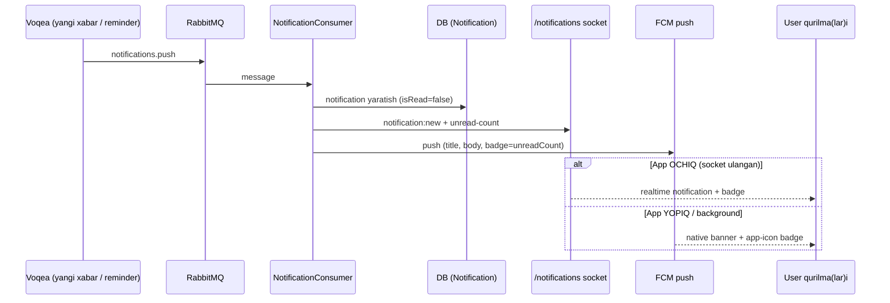
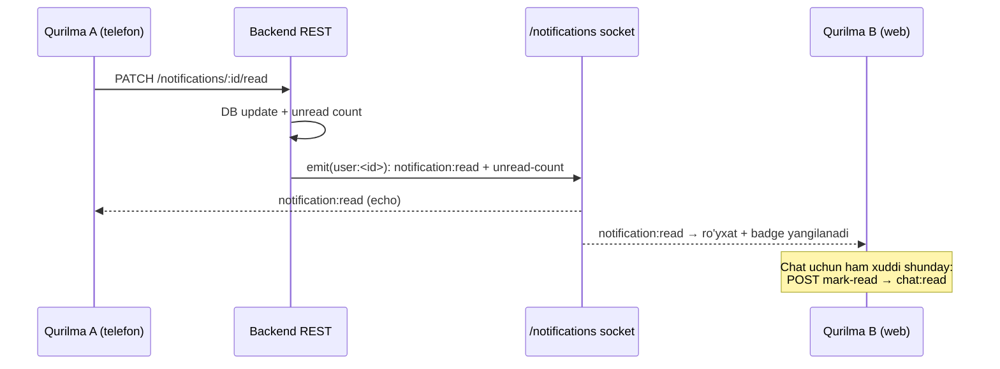

# 1Fin — Mobile Notifications To'liq Yo'riqnomasi

> Auditoriya: **one_fin** (Flutter) developer.
> Backend: `main` (WebSocket + read-sync + Redis adapter). Deploy'dan keyin amal qiladi.
> Base host: `https://jr-techno.uz`, API prefix: `/api/v1`.

---

## 0. Nima o'zgardi (TL;DR)

1. **Yangi WebSocket kanali** — `/notifications` namespace. App **ochiq** bo'lganda
   notification'lar realtime shu socket orqali keladi. Web'da FCM ishlamagani uchun
   web'da **asosiy** kanal shu. Mobile'da esa FCM'ga **qo'shimcha** (app ochiq paytda
   darhol ko'rsatish uchun).
2. **`DELETE /notifications/devices/{token}` tuzatildi.** Ilgari bu route yo'q edi →
   **404** ("javob kelmayapti" muammosi shu edi). Endi ishlaydi. Sizning hozirgi
   kodingiz (`notificationDeviceByFcmToken`) **o'zgarishsiz** ishlaydi.
3. **Yangi `GET /notifications/devices`** — user'ning ro'yxatga olingan aktiv
   qurilmalari. Token registratsiyasini tekshirish uchun.
4. **Read-sync (Telegram-uslub)** — bir qurilmada bell/chat o'qilsa, boshqa
   qurilmalarda badge darhol yangilanadi. Yangi socket eventlar: `notification:read`,
   `notification:read-all`, `notification:deleted`, `chat:read`, `chat:read-all`
   (§3.1). Client bularni **tinglashi** kerak (bo'lim §6).
5. **Sanalar UTC** — REST va socket'dagi `createdAt` va h.k. barchasi UTC (`...Z`).
   UI'da `.toLocal()` qiling, aks holda 5 soat orqada ko'rinadi (bo'lim §7).

---

## 1. Umumiy arxitektura — socket vs FCM qachon

| Holat | Kanal |
|---|---|
| App **ochiq** (foreground), web yoki mobile | **WebSocket** `notification:new` |
| App **yopiq/background**, mobile (Android/iOS) | **FCM** push (native banner) |
| App **yopiq/background**, **web** | ⚠️ Ishonchli emas — bu holatda yetkazish yo'q (browser cheklovi). App ochilganda `GET /notifications` bilan sync qiling. |

**Muhim:** socket va FCM **bir xil** notification'ni yetkazishi mumkin (ikkalasi ham
bitta `NotificationConsumer`dan chiqadi). App ochiq paytda ikkovi ham kelib, **dublikat**
banner chiqmasligi uchun:
- App foreground bo'lsa — FCM foreground handler'da bannerni **ko'rsatmang**, socket'ga
  tayaning (yoki `notification.id` bo'yicha dedup qiling).
- Har doim `GET /notifications` + `GET /notifications/unread-count` bilan haqiqiy
  holatni sync qiling (socket faqat "tezkor xabarchi", manba emas).

### 1.1 Oqim diagrammalari

**A. Yangi notification yetkazish** — app ochiq (socket) vs yopiq (FCM badge):



**B. Qurilmalararo read-sync (Telegram hissi)** — bir qurilmada o'qish → boshqasi yangilanadi:



> **Reconcile:** socket event o'tkazib yuborilsa (uzilish), qurilma reconnect/
> foreground'da `GET .../unread-count` + `unread-summary` bilan haqiqiy holatga qaytadi.

---

## 2. Base URL va Auth

- REST: `https://jr-techno.uz/api/v1/...` (`Authorization: Bearer <accessToken>`)
- Socket namespace'lari **prefix'siz**, origin'da: `https://jr-techno.uz/notifications`
  (chat esa `https://jr-techno.uz/chat`). Engine path — standart `/socket.io/`.
- Auth: socket handshake'da JWT — `auth.token` **yoki** `Authorization: Bearer` header.
  Token noto'g'ri/yo'q bo'lsa server darhol `disconnect` qiladi.

`ApiEndpoints`/`AppApiConfig`ga qo'shing (chat bilan bir xil pattern):

```dart
// app_api_config.dart
/// Socket.IO namespace `/notifications` on the same host.
static String get notificationsSocketNamespaceUrl => '$origin/notifications';

// api_endpoints.dart
static String get notificationsSocketUrl =>
    AppApiConfig.notificationsSocketNamespaceUrl;
```

---

## 3. WebSocket realtime notifications

### 3.1 Server → client event'lar

Barcha eventlar `user:<userId>` xonasiga boradi — ya'ni user'ning **barcha
qurilma/tab**lariga. Bu qurilmalararo real-time sync beradi (Telegram-uslub).

**Bell (notification) eventlari:**
| Event | Payload | Izoh |
|---|---|---|
| `notification:connected` | `{ userId }` | Ulanish + auth muvaffaqiyatli. |
| `notification:new` | `{ id, title, body, data, isRead, createdAt }` | Yangi notification. `data.type` ichida tur (`NEW_MESSAGE`, `DOCUMENT_REMINDER`, ...) — tap routing uchun. |
| `notification:read` | `{ id, unreadCount }` | Bitta bell o'qildi (istalgan qurilmada). Ro'yxatda o'sha itemni read qil. |
| `notification:read-all` | `{ unreadCount }` | Hammasi o'qildi. |
| `notification:deleted` | `{ id, unreadCount }` | Bitta o'chirildi. |
| `notification:deleted-all` | `{ unreadCount }` | Hammasi o'chirildi. |
| `notification:unread-count` | `{ unreadCount }` | Bell badge — YAGONA manba. Yuqoridagi har harakatdan keyin keladi. |

**Chat (xabar) read-receipt eventlari:**
| Event | Payload | Izoh |
|---|---|---|
| `chat:read` | `{ companyId, globalDepartmentId }` | Shu bo'lim o'qildi (boshqa qurilmada). O'sha bo'lim unread'ini 0 qil, chat badge'ni qayta hisobla. |
| `chat:read-all` | `{ companyId, globalDepartmentIds }` | Kompaniyadagi barcha bo'limlar o'qildi. |

> **Chat badge mantiqi (muhim):** server chat total'ni yubormaydi (masshtab uchun).
> Client `chat:read`/`chat:read-all` bo'yicha lokal hisoblagichni yangilaydi, va
> ulanish/reconnect'da `GET /notifications/../unread-summary` bilan solishtiradi
> (haqiqat manbai — server). Bell badge esa har eventda `unreadCount` bilan keladi.

Client hech narsa **emit qilmaydi** — ulanadi va tinglaydi. Read/mark-read'lar
oldingidek REST orqali bo'ladi; socket faqat natijani boshqa qurilmalarga tarqatadi.
Server ulanish paytida avtomatik `user:<userId>` xonasiga qo'shadi (JWT `sub`).

### 3.2 Transport (MUHIM — chat bilan bir xil)

- **Web:** `['polling']` — brauzerda bu client raw websocket'ni ochmaydi.
- **Mobile/desktop:** `['websocket', 'polling']`.

### 3.3 `notification:new` payload namunasi

```json
{
  "id": "clx...cuid",
  "title": "Yangi xabar - Ali Valiyev",
  "body": "Salom, hujjatni ko'rib chiqing",
  "data": {
    "type": "NEW_MESSAGE",
    "companyId": "clx...",
    "globalDepartmentId": "clx...",
    "messageId": "clx..."
  },
  "isRead": false,
  "createdAt": "2026-07-28T10:00:00.000Z"
}
```

### 3.4 Drop-in Dart service (`NotificationSocketService`)

`chat_socket_service.dart` bilan bir xil uslubda. `lib/core/network/` ga qo'ying:

```dart
// ignore_for_file: library_prefixes
import 'dart:async';
import 'dart:convert';
import 'package:flutter/foundation.dart';
import 'package:socket_io_client/socket_io_client.dart' as IO;
import 'package:one_fin/core/constants/api_endpoints.dart';
import 'package:one_fin/core/constants/secure_storage.dart';
import 'package:one_fin/core/failure/log_service.dart';

/// Realtime in-app notifications (Socket.IO namespace `/notifications`).
/// App ochiq paytda notification'larni socket orqali oladi (web'da asosiy kanal).
class NotificationSocketService {
  final LocalSecureDataSource _localDataSource;
  IO.Socket? _socket;
  bool _isConnecting = false;
  bool get isConnected => _socket?.connected ?? false;

  final _newController = StreamController<Map<String, dynamic>>.broadcast();
  final _unreadController = StreamController<int>.broadcast();
  final _connectionController = StreamController<bool>.broadcast();

  Stream<Map<String, dynamic>> get onNewNotification => _newController.stream;
  Stream<int> get onUnreadCount => _unreadController.stream;
  Stream<bool> get onConnectionChange => _connectionController.stream;

  NotificationSocketService({required LocalSecureDataSource localDataSource})
      : _localDataSource = localDataSource;

  Future<void> connect() async {
    if (_isConnecting) return;
    if (_socket != null && _socket!.connected) return;
    _isConnecting = true;

    try {
      final token = await _localDataSource.getUserAccessToken();
      if (token == null || token.isEmpty) {
        LogService.e('Notif socket: access token null/empty');
        _isConnecting = false;
        return;
      }

      final transports = kIsWeb ? ['polling'] : ['websocket', 'polling'];

      _socket = IO.io(
        ApiEndpoints.notificationsSocketUrl,
        IO.OptionBuilder()
            .setTransports(transports)
            .setAuth({'token': token})
            .setExtraHeaders({'Authorization': 'Bearer $token'})
            .enableAutoConnect()
            .enableReconnection()
            .setReconnectionDelay(2000)
            .setReconnectionDelayMax(10000)
            .setReconnectionAttempts(5)
            .setTimeout(20000)
            .enableForceNew()
            .disableMultiplex()
            .build(),
      );

      _setupHandlers();
      _socket!.connect();
    } catch (e) {
      LogService.e('Notif socket init error: $e');
      _isConnecting = false;
    }
  }

  void _setupHandlers() {
    if (_socket == null) return;

    _socket!.onAny((event, data) {
      if (event == 'ping' || event == 'pong') return;
      final log = data is Map || data is List ? jsonEncode(data) : data.toString();
      LogService.i('📥 [NOTIF SOCKET] $event | $log');
    });

    _socket!.onConnect((_) {
      _isConnecting = false;
      _connectionController.add(true);
      LogService.i('✅ Notif socket connected');
    });
    _socket!.onDisconnect((r) {
      _connectionController.add(false);
      LogService.w('⚠️ Notif socket disconnected: $r');
    });
    _socket!.onConnectError((e) {
      _isConnecting = false;
      _connectionController.add(false);
      LogService.e('❌ Notif socket connect error: $e');
    });

    _socket!.on('notification:connected', (data) {
      LogService.i('🔔 Notif socket authenticated: $data');
    });

    _socket!.on('notification:new', (data) {
      try {
        final map = Map<String, dynamic>.from(data as Map);
        _newController.add(map);
        LogService.i('🔔 New notification: ${map['title']}');
        // TODO: foreground bo'lsa local banner ko'rsating (id bo'yicha dedup).
      } catch (e) {
        LogService.e('Parse notification:new error: $e');
      }
    });

    _socket!.on('notification:unread-count', (data) {
      final c = (data is Map ? data['unreadCount'] : null);
      if (c is int) _unreadController.add(c);
    });
  }

  Future<void> reconnect() async {
    _socket?.disconnect();
    await Future.delayed(const Duration(milliseconds: 500));
    await connect();
  }

  void disconnect() {
    _isConnecting = false;
    if (_socket != null) {
      _socket!.disconnect();
      _socket!.dispose();
      _socket = null;
    }
    _connectionController.add(false);
  }

  void dispose() {
    disconnect();
    _newController.close();
    _unreadController.close();
    _connectionController.close();
  }
}
```

### 3.5 Lifecycle (qачon connect/disconnect)

- **Login muvaffaqiyatli / app start (token bor)** → `notificationSocket.connect()`.
- **Logout** → `notificationSocket.disconnect()` (+ device unregister, quyida).
- **`onNewNotification`** → in-app badge/list yangilang, kerak bo'lsa local banner.
- **`onUnreadCount`** → tab/icon badge.
- Reconnect avtomatik (options'da yoqilgan). Uzilib qайta ulanganda `GET /notifications`
  bilan sync qiling (socket o'chiq paytdagilarni ushlab olish uchun).

### 3.6 Qo'shimcha listener'lar (read-sync)

`_setupHandlers()` ichiga read-sync listener'larni ham qo'shing — ular boshqa
qurilmadagi read/delete'ni shu qurilmaga tarqatadi. To'liq ro'yxat, payload'lar va
client state mantiqi **§6 (Read-sync — client state model)**da. Qisqacha:
`notification:read/read-all/deleted/deleted-all` (bell) va `chat:read/chat:read-all`
(xabar badge). Bu event'lar faqat user'ning **o'z** qurilmalariga boradi.

---

## 4. Device (FCM token) REST endpoints — to'liq kontrakt

Barchasi `Authorization: Bearer <token>` talab qiladi.

### 4.1 Register — `POST /api/v1/notifications/devices`
Body:
```json
{ "fcmToken": "<token>", "platform": "WEB" }
```
`platform`: `ANDROID` | `IOS` | `WEB`. Upsert — token boshqa userga tegishli bo'lsa,
joriy userga qaйta biriktiriladi. **Bu endpoint ishlaydi, o'zgarmadi.**

Javob `201`:
```json
{ "id": "...", "fcmToken": "...", "platform": "WEB", "isActive": true, "lastSeenAt": "..." }
```

### 4.2 List (YANGI) — `GET /api/v1/notifications/devices`
Joriy user'ning aktiv qurilmalari. Token ro'yxatga olinganini tekshirish uchun.
```json
{ "data": [ { "id": "...", "fcmToken": "...", "platform": "WEB", "isActive": true, "lastSeenAt": "...", "createdAt": "..." } ], "meta": { "total": 1 } }
```

### 4.3 Unregister — ikki variant, ikkovi ham ishlaydi

**(a) Tavsiya etilgan — body'da token:**
```
DELETE /api/v1/notifications/devices
Body: { "fcmToken": "<token>" }
```

**(b) Hozirgi mobile kodi — token URL'da (legacy, endi ishlaydi):**
```
DELETE /api/v1/notifications/devices/<URL-encoded-token>
```
Sizning hozirgi kodingiz:
```dart
_dioClient.delete(
  ApiEndpoints.notificationDeviceByFcmToken(Uri.encodeComponent(fcmToken)),
);
```
**O'zgartirish shart emas** — bu endi to'g'ri ishlaydi (deploy'dan keyin). Javob:
`{ "unregistered": 1 }`.

> **Nega ilgari "javob kelmayapti" edi?** `DELETE /notifications/devices/{token}` —
> ya'ni 2 segmentli path — backend'da hech qanday route'ga to'g'ri kelmасdi va **404**
> qaytardi. Endi legacy route qo'shildi. Uzoq muddatda **(a) body variant**iga o'tish
> yaxshiroq (token ichida maxsus belgi bo'lsa xavfsizroq), lekin majburiy emas.

---

## 5. In-app notifications REST (socket'ni to'ldiradi)

| Metod | Endpoint | Vazifa |
|---|---|---|
| GET | `/notifications?page=1&limit=20` | Ro'yxat (`data`, `meta.unreadCount`). App ochilganda sync. |
| GET | `/notifications/unread-count` | `{ unreadCount }` badge uchun. |
| PATCH | `/notifications/:id/read` | Bittasini o'qilgan qilish. |
| PATCH | `/notifications/read-all` | Hammasini o'qilgan qilish. |
| DELETE | `/notifications/:id` | Bittasini o'chirish. |
| DELETE | `/notifications` | Hammasini o'chirish. |

**Sync qoidasi:** socket "push", REST "manba". App har ochilganda/foreground'ga
qaйtganda `GET /notifications` + `unread-count` bilan haqiqiy holatni oling.

---

## 6. Read-sync — client state model (bell + chat)

Maqsad: user telefonda o'qisa → web'da ham darhol o'qilgan, badge yangilangan
(Telegram hissi). Backend har read/delete harakatidan keyin user'ning **barcha**
qurilmalariga (`user:<id>` xonasi) event yuboradi. Client shularni tinglaydi.

### 6.1 Ikki alohida counter

| Counter | Manba (REST) | Socket'da yangilanadi |
|---|---|---|
| **Bell** (qo'ng'iroq) | `GET /notifications/unread-count` → `{ unreadCount }` | `notification:unread-count` (har bell eventida keladi) |
| **Chat** (xabar badge) | `GET .../unread-summary` → per-company/department | `chat:read` / `chat:read-all` (client o'zi qayta hisoblaydi) |

Bularni **alohida** saqlang — ular boshqa-boshqa domenlar.

### 6.2 Bell counter — oson

Bell eventlarining **har biri** yangi `unreadCount` bilan keladi → to'g'ridan-to'g'ri
badge'ga yozing. Ro'yxatni ham yangilang:

```dart
_socket!.on('notification:read',        (d) => markReadInList(d['id']));
_socket!.on('notification:read-all',    (_) => markAllReadInList());
_socket!.on('notification:deleted',     (d) => removeFromList(d['id']));
_socket!.on('notification:deleted-all', (_) => clearList());
_socket!.on('notification:unread-count',(d) => bellBadge = d['unreadCount']); // YAGONA manba
```

### 6.3 Chat counter — read-receipt (server total yubormaydi)

**Muhim dizayn:** masshtab uchun server chat total'ni QAYTA HISOBLAMAYDI. U faqat
"shu bo'lim o'qildi" deb yengil receipt yuboradi. Client o'z lokal hisoblagichini
yangilaydi:

```dart
_socket!.on('chat:read', (d) {
  // (d['companyId'], d['globalDepartmentId']) unread = 0
  setDepartmentUnread(d['companyId'], d['globalDepartmentId'], 0);
  recomputeChatBadge(); // lokal yig'indi
});
_socket!.on('chat:read-all', (d) {
  // d['companyId'] dagi barcha bo'limlar unread = 0
  clearCompanyUnread(d['companyId'], d['globalDepartmentIds']);
  recomputeChatBadge();
});
```

**Aktiv (ochiq) bo'lim — inkrement QILMANG:** foydalanuvchi hozir ochib turgan
bo'lim chatiga xabar kelsa (`message:new`), o'sha bo'lim unread'ini **oshirmang**.
Backend ham buni qo'llab-quvvatlaydi — user socket room'ida aktiv bo'lsa, o'sha
xabar uchun bell/FCM yubormaydi va `unread-summary`da ham sanamaydi (lastReadAt
yangilanadi). Ya'ni: `message:new` kelganda faqat **ochiq bo'lmagan** bo'limlar
uchun unread'ni oshiring.

### 6.4 Drift'dan himoya (majburiy)

Socket eventlar o'tkazib yuborilishi mumkin (uzilish paytida). Shuning uchun
**har connect/reconnect va foreground'ga qaytishda** REST bilan reconcile qiling:
- Bell: `GET /notifications/unread-count`
- Chat: `GET .../unread-summary`

Server — yagona haqiqat manbai; socket faqat tezkor yangilanish. Bu ikkovини
birlashtirsa — Telegram darajasidagi ishonchli sync bo'ladi.

> **Eslatma:** read/mark-read harakatini o'zingiz REST orqali qilasiz (masalan
> `PATCH /notifications/:id/read`, `POST departments/:id/mark-read/...`). Socket
> shu harakatning natijasini boshqa qurilmalarga tarqatadi — client **emit
> qilmaydi**, faqat tinglaydi.

---

## 7. Sanalar — timezone (`.toLocal()`)

Backend **barcha** sanalarni UTC ISO formatida qaytaradi (`2026-07-30T09:00:00.000Z`) —
REST'da ham, socket payload'ida ham (`notification:new` dagi `createdAt` va h.k.).
Bu **to'g'ri kontrakt** (o'zgarmaydi).

**Mobile qoidasi:** parse qilganda darhol local'ga o'giring, aks holda UI 5 soat
orqada (UTC) ko'rsatadi:

```dart
final createdAt = DateTime.parse(json['createdAt']).toLocal();       // parse
final ts = DateTime.tryParse(json['createdAt'])?.toLocal();          // nullable
```

- Formatlashda (`DateFormat`) DateTime local bo'lishi shart — `.toLocal()` UTC field'larni
  qurilma vaqtiga (O'zbekiston UTC+5) o'giradi.
- Socket'dan kelgan `createdAt`ga ham xuddi shu qoida.
- Backend'dagi REST model'lar uchun tayyor fix: `fix/dates-uzbekistan-timezone`
  branch (one_fin repo) — 22 ta parse joyiga `.toLocal()` qo'shilgan; merge qiling.

---

## 8. FCM native banner + badge (mobile side)

> 📄 **FCM push va device token registratsiyasi to'liq** — alohida hujjatda:
> **`MOBILE_FCM_PUSH_GUIDE.md`** (registratsiya, push qachon yuborilmaydi,
> "notif kelmay qoldi" troubleshooting). Quyida qisqacha.

### 8.1 Badge (unread count) — endi push'da keladi ✅
Har FCM push'ga user'ning o'qilmagan notification soni qo'shiladi (app **yopiq**da
ham badge to'g'ri bo'lishi uchun — socket faqat app ochiqda ishlaydi):

| Maydon | Platforma | Ishlatish |
|---|---|---|
| `apns.payload.aps.badge` (number) | iOS | OS **avtomatik** app-icon badge'ga qo'yadi — qo'shimcha kod shart emas. |
| `android.notification.notificationCount` | Android | Best-effort — ba'zi launcher'lar ko'rsatadi. |
| `data.unreadCount` (string) | Android (ishonchli) | Client o'qib launcher badge'ni qo'yadi, masalan `flutter_app_badger`: `AppBadger.updateBadgeCount(int.parse(unreadCount))`. |

> Bell (notification) badge'i bilan bir xil manba (`Notification.isRead`). App
> ochiq bo'lganda socket `notification:unread-count` bilan yangilanadi; yopiqda —
> keyingi push badge'ni yangilaydi.

### 8.2 Bo'sh banner (ochiq masala)
- Ba'zан banner **bo'sh** (title/body yo'q) kelardi. Backend `notification:{title,body}`
  ni to'g'ri yuboradi (tasdiqlangan) — sabab mobile tomonda. Foreground handler'da
  to'liq payload'ni log qiling: `FCM [foreground] full payload: ...` — shu log kerak.
- iOS push umuman kelmasa — **backend emas, Firebase Console** masalasi (APNs .p8 key).
- Foreground'da FCM banner + socket banner **dublikat** bo'lmasin: FCM bannerni
  bostiring, socket'ga tayaning (yoki `notification.id`/`messageId` bo'yicha dedup).

---

## 9. Tekshiruv checklist

**WebSocket ulanish**
- [ ] `notificationsSocketUrl` qo'shildi (`$origin/notifications`).
- [ ] `NotificationSocketService` login'da `connect()`, logout'da `disconnect()`.
- [ ] Web'da transport `['polling']`, mobile'da `['websocket','polling']`.

**Bell (notification)**
- [ ] `notification:new` → badge/list yangilanadi, foreground'da banner (dedup bilan).
- [ ] `notification:read` / `read-all` / `deleted` / `deleted-all` → ro'yxat yangilanadi.
- [ ] `notification:unread-count` → bell badge (yagona manba).

**Chat read-sync**
- [ ] `chat:read` → o'sha bo'lim unread=0, chat badge qayta hisoblanadi.
- [ ] `chat:read-all` → kompaniyadagi barcha bo'limlar unread=0.
- [ ] Connect/reconnect va foreground'da REST reconcile (`unread-count` + `unread-summary`).

**Device (FCM token)**
- [ ] `POST /notifications/devices` register (bor) ishlayapti.
- [ ] `DELETE /notifications/devices/{token}` endi `{unregistered:1}` qaytaradi (404 emas).
- [ ] `GET /notifications/devices` bilan token ro'yxatda ekanini tekshirdim.

**Sanalar & FCM**
- [ ] Barcha sana parse'da `.toLocal()` (REST + socket `createdAt`). Date branch merge qilindi.
- [ ] iOS badge avtomatik ishlaydi (`aps.badge`); Android `data.unreadCount` bilan launcher badge qo'yildi.
- [ ] App ochilganda `GET /notifications` bilan sync.
- [ ] Foreground'da FCM + socket dublikat banner yo'q.

---

**Savol/tasdiq:** socket ulanmasa avval token (JWT `sub`), keyin transport (web=polling),
keyin URL (`/notifications`, prefix'siz) ni tekshiring. Kerak bo'lsa backend loglaridan
`Notifications socket connected: ..., User: ...` ni ko'rish mumkin.
